# Vulkan Pipeline Setup: Tutorial 01–03 Breakdown

## Architecture Overview

| Tutorial | Base Class | Purpose |
|---|---|---|
| `Tutorial01` | `os::ProjectBase` | Device initialization only — no rendering |
| `Tutorial02` | `os::ProjectBase` | Adds presentation surface, swapchain, and a clear-color render via transfer commands |
| `Tutorial03` | `TutorialBase` | Builds on the abstracted base to add a real graphics pipeline, render pass, framebuffers, and shader-driven triangle draw |

`TutorialBase` (used by Tutorial03) encapsulates the full device + swapchain setup that Tutorial02 duplicates inline. Tutorial01 is a self-contained bootstrapper with no window or rendering.

---

## Pipeline Divergence Flowchart

```mermaid
flowchart TD
    A["**loadVulkanLibrary**
    dlopen('libvulkan.so.1')"] --> B

    B["**loadExportedEntryPoints**
    dlsym → vkGetInstanceProcAddr"] --> C

    C["**loadGlobalLevelEntryPoints**
    vkGetInstanceProcAddr(null, ...)
    vkCreateInstance · vkEnumerateInstanceLayerProperties"] --> D

    D["**createInstance**
    VkApplicationInfo + VkInstanceCreateInfo
    vkCreateInstance"] --> E

    E["**setupDebugMessenger** (optional)
    vkCreateDebugUtilsMessengerEXT
    VK_EXT_debug_utils"] --> F

    F["**loadInstanceLevelEntryPoints**
    vkGetInstanceProcAddr(instance, ...)
    vkEnumeratePhysicalDevices · vkCreateDevice"] --> DIV1

    DIV1{{"⬦ Divergence Point 1"}}

    DIV1 -->|"Tutorial01 only"| T01_DEV
    DIV1 -->|"Tutorial02 + Tutorial03"| T0203_SURF

    %% ─── TUTORIAL 01 BRANCH ───
    T01_DEV["**createDevice**
    No surface · No device extensions
    Selects VK_QUEUE_GRAPHICS_BIT only
    1× VkDeviceQueueCreateInfo"] --> T01_DLEP

    T01_DLEP["**loadDeviceLevelEntryPoints**
    vkGetDeviceProcAddr(device, ...)"] --> T01_GDQ

    T01_GDQ["**getDeviceQueue**
    vkGetDeviceQueue
    1 queue (graphics only)"] --> T01_DONE

    T01_DONE(["✓ Tutorial01 COMPLETE
    No surface · No swapchain · No rendering"])

    %% ─── TUTORIAL 02 + 03 SHARED ───
    T0203_SURF["**createPresentationSurface**
    vkCreateXlibSurfaceKHR
    Instance extensions: VK_KHR_surface
    + VK_KHR_xlib_surface"] --> T0203_DEV

    T0203_DEV["**createDevice** (surface-aware)
    vkEnumerateDeviceExtensionProperties
    vkGetPhysicalDeviceSurfaceSupportKHR
    Device extension: VK_KHR_swapchain
    Selects graphics queue + present queue"] --> T0203_DLEP

    T0203_DLEP["**loadDeviceLevelEntryPoints**
    vkGetDeviceProcAddr(device, ...)"] --> T0203_GDQ

    T0203_GDQ["**getDeviceQueue**
    vkGetDeviceQueue × 2
    graphics queue + present queue
    (may be same family or different)"] --> T0203_SEM

    T0203_SEM["**createSemaphores**
    vkCreateSemaphore × 2
    image_available_semaphore
    rendering_finished_semaphore"] --> DIV2

    DIV2{{"⬦ Divergence Point 2"}}

    DIV2 -->|"Tutorial02 only"| T02_SC
    DIV2 -->|"Tutorial03 only"| T03_SC

    %% ─── TUTORIAL 02 BRANCH ───
    T02_SC["**createSwapChain**
    vkGetPhysicalDeviceSurfaceCapabilitiesKHR
    vkGetPhysicalDeviceSurfaceFormatsKHR
    vkGetPhysicalDeviceSurfacePresentModesKHR
    vkCreateSwapchainKHR
    ⚠ No VkImageViews created"] --> T02_CP

    T02_CP["**createCommandPool**
    vkCreateCommandPool
    ⚠ On PRESENT queue family"] --> T02_ACB

    T02_ACB["**allocateCommandBuffers**
    vkGetSwapchainImagesKHR
    vkAllocateCommandBuffers
    1× primary buffer per swapchain image"] --> T02_RCB

    T02_RCB["**recordCommandBuffers**
    vkBeginCommandBuffer
    vkCmdPipelineBarrier (UNDEFINED → TRANSFER_DST)
    vkCmdClearColorImage ← clear happens here
    vkCmdPipelineBarrier (TRANSFER_DST → PRESENT_SRC)
    vkEndCommandBuffer
    ⚠ No render pass · No pipeline · No shaders"] --> T02_DRAW

    T02_DRAW(["**draw() loop**
    vkAcquireNextImageKHR
    vkQueueSubmit → present queue
      wait: VK_PIPELINE_STAGE_TRANSFER_BIT
    vkQueuePresentKHR
    ─────────────────────
    ✓ Tutorial02 COMPLETE
    Renders solid clear color"])

    %% ─── TUTORIAL 03 BRANCH ───
    T03_SC["**createSwapChain** (via TutorialBase)
    vkGetPhysicalDeviceSurfaceCapabilitiesKHR
    vkGetPhysicalDeviceSurfaceFormatsKHR
    vkGetPhysicalDeviceSurfacePresentModesKHR
    vkCreateSwapchainKHR"] --> T03_IV

    T03_IV["**createSwapChainImageViews** (TutorialBase)
    vkCreateImageView per swapchain image
    ✓ Required for framebuffer attachments"] --> T03_RP

    T03_RP["**createRenderPass**
    vkCreateRenderPass
    VkAttachmentDescription: loadOp=CLEAR storeOp=STORE
    finalLayout = VK_IMAGE_LAYOUT_PRESENT_SRC_KHR
    VkSubpassDescription: GRAPHICS bind point"] --> T03_FB

    T03_FB["**createFramebuffers**
    vkCreateFramebuffer × N
    Binds each VkImageView as color attachment
    Tied to the render pass"] --> T03_PL

    T03_PL["**createPipeline**
    ┌─ vkCreateShaderModule × 2 (vert + frag SPIR-V)
    ├─ VkPipelineShaderStageCreateInfo × 2
    ├─ VkPipelineVertexInputStateCreateInfo (no vertex buffers)
    ├─ VkPipelineInputAssemblyStateCreateInfo (TRIANGLE_LIST)
    ├─ VkPipelineViewportStateCreateInfo (300×300)
    ├─ VkPipelineRasterizationStateCreateInfo (FILL, cull BACK)
    ├─ VkPipelineMultisampleStateCreateInfo (1 sample)
    ├─ VkPipelineColorBlendStateCreateInfo (blend disabled)
    ├─ vkCreatePipelineLayout (empty — no descriptors)
    └─ vkCreateGraphicsPipelines"] --> T03_CP

    T03_CP["**createCommandPool**
    vkCreateCommandPool
    ✓ On GRAPHICS queue family"] --> T03_ACB

    T03_ACB["**allocateCommandBuffers**
    vkAllocateCommandBuffers
    1× primary buffer per swapchain image"] --> T03_RCB

    T03_RCB["**recordCommandBuffers**
    vkBeginCommandBuffer
    (opt) vkCmdPipelineBarrier — queue ownership acquire
    vkCmdBeginRenderPass ← loadOp clears here
    vkCmdBindPipeline (GRAPHICS)
    vkCmdDraw(3, 1, 0, 0) ← 3 verts from vertex shader
    vkCmdEndRenderPass ← storeOp writes here
    (opt) vkCmdPipelineBarrier — queue ownership release
    vkEndCommandBuffer"] --> T03_DRAW

    T03_DRAW(["**draw() loop**
    vkAcquireNextImageKHR
    vkQueueSubmit → graphics queue
      wait: VK_PIPELINE_STAGE_COLOR_ATTACHMENT_OUTPUT_BIT
    vkQueuePresentKHR → present queue
    ─────────────────────
    ✓ Tutorial03 COMPLETE
    Renders shader-driven triangle"])

    %% ─── STYLES ───
    style DIV1 fill:#7b4f00,color:#fff,stroke:#c47d00
    style DIV2 fill:#7b4f00,color:#fff,stroke:#c47d00
    style T01_DONE fill:#3a3a3a,color:#fff,stroke:#888
    style T02_DRAW fill:#0d5c7a,color:#fff,stroke:#0a90bf
    style T03_DRAW fill:#0d6b35,color:#fff,stroke:#0aab50
    style T02_RCB  fill:#103d52,color:#ddf,stroke:#0a90bf
    style T03_RCB  fill:#0d4222,color:#ddf,stroke:#0aab50
    style T03_PL   fill:#2a1a4a,color:#ddf,stroke:#8855cc
```



---

## Detailed Step Breakdown

### Tutorial 01 — Device Initialization

**Goal:** Load Vulkan, create a logical device, retrieve a queue handle. No window, no rendering.

#### Step 1 — Load Vulkan Library
**Source:** `lib/Tutorial01.cpp:146`

```cpp
m_vulkan_library_handle = dlopen("libvulkan.so.1", RTLD_NOW);
```

The Vulkan loader (`libvulkan.so`) is a shared library that dispatches calls to the
real ICD. You obtain the first entry point via `dlsym` before any Vulkan API is
available.

> **Spec:** [`vkGetInstanceProcAddr`](https://registry.khronos.org/vulkan/specs/latest/man/html/vkGetInstanceProcAddr.html)

---

#### Step 2 — Load Exported Entry Points
**Source:** `lib/Tutorial01.cpp:156`

Uses `dlsym` (via the `VK_EXPORTED_FUNCTION` macro over `ListOfFunctions.inl`) to pull
`vkGetInstanceProcAddr` out of the library. This is the only function obtained this way —
everything else flows through it.

> **Spec:** [`vkGetInstanceProcAddr`](https://registry.khronos.org/vulkan/specs/latest/man/html/vkGetInstanceProcAddr.html)

---

#### Step 3 — Load Global-Level Entry Points
**Source:** `lib/Tutorial01.cpp:174`

Calls `vkGetInstanceProcAddr(nullptr, ...)` to load functions that don't require a
`VkInstance` yet:

- [`vkCreateInstance`](https://registry.khronos.org/vulkan/specs/latest/man/html/vkCreateInstance.html)
- [`vkEnumerateInstanceLayerProperties`](https://registry.khronos.org/vulkan/specs/latest/man/html/vkEnumerateInstanceLayerProperties.html)
- [`vkEnumerateInstanceExtensionProperties`](https://registry.khronos.org/vulkan/specs/latest/man/html/vkEnumerateInstanceExtensionProperties.html)

---

#### Step 4 — Create Instance
**Source:** `lib/Tutorial01.cpp:190`

1. **`checkValidationLayerSupport()`** — calls
   [`vkEnumerateInstanceLayerProperties`](https://registry.khronos.org/vulkan/specs/latest/man/html/vkEnumerateInstanceLayerProperties.html)
   and verifies `VK_LAYER_KHRONOS_validation` is present.

2. **Fill [`VkApplicationInfo`](https://registry.khronos.org/vulkan/specs/latest/man/html/VkApplicationInfo.html)** — declares the app name, engine name, and
   `apiVersion = VK_MAKE_VERSION(1,3,0)`.

3. **Fill [`VkInstanceCreateInfo`](https://registry.khronos.org/vulkan/specs/latest/man/html/VkInstanceCreateInfo.html)** — attaches `VkApplicationInfo`; conditionally
   enables `VK_EXT_DEBUG_UTILS_EXTENSION_NAME` when debug mode is on.

4. **[`vkCreateInstance`](https://registry.khronos.org/vulkan/specs/latest/man/html/vkCreateInstance.html)** — creates the `VkInstance`.

5. **`setupDebugMessenger()`** — dynamically loads
   [`vkCreateDebugUtilsMessengerEXT`](https://registry.khronos.org/vulkan/specs/latest/man/html/vkCreateDebugUtilsMessengerEXT.html)
   via `vkGetInstanceProcAddr` and registers a
   [`VkDebugUtilsMessengerEXT`](https://registry.khronos.org/vulkan/specs/latest/man/html/VkDebugUtilsMessengerEXT.html)
   that routes validation messages to the logging system.

---

#### Step 5 — Load Instance-Level Entry Points
**Source:** `lib/Tutorial01.cpp:253`

Calls `vkGetInstanceProcAddr(instance, ...)` to load instance-scoped functions:

- [`vkEnumeratePhysicalDevices`](https://registry.khronos.org/vulkan/specs/latest/man/html/vkEnumeratePhysicalDevices.html)
- [`vkGetPhysicalDeviceProperties`](https://registry.khronos.org/vulkan/specs/latest/man/html/vkGetPhysicalDeviceProperties.html)
- [`vkGetPhysicalDeviceFeatures`](https://registry.khronos.org/vulkan/specs/latest/man/html/vkGetPhysicalDeviceFeatures.html)
- [`vkGetPhysicalDeviceQueueFamilyProperties`](https://registry.khronos.org/vulkan/specs/latest/man/html/vkGetPhysicalDeviceQueueFamilyProperties.html)
- [`vkCreateDevice`](https://registry.khronos.org/vulkan/specs/latest/man/html/vkCreateDevice.html)

---

#### Step 6 — Create Logical Device
**Source:** `lib/Tutorial01.cpp:272`

1. [`vkEnumeratePhysicalDevices`](https://registry.khronos.org/vulkan/specs/latest/man/html/vkEnumeratePhysicalDevices.html) — enumerate all GPUs.

2. **`checkPhysicalDeviceProperties()`** — for each physical device:
   - [`vkGetPhysicalDeviceProperties`](https://registry.khronos.org/vulkan/specs/latest/man/html/vkGetPhysicalDeviceProperties.html) — checks `apiVersion >= 1.x` and
     `maxImageDimension2D >= 4096`.
   - [`vkGetPhysicalDeviceQueueFamilyProperties`](https://registry.khronos.org/vulkan/specs/latest/man/html/vkGetPhysicalDeviceQueueFamilyProperties.html) — selects the first
     queue family with `VK_QUEUE_GRAPHICS_BIT`.

3. Fill [`VkDeviceQueueCreateInfo`](https://registry.khronos.org/vulkan/specs/latest/man/html/VkDeviceQueueCreateInfo.html) — one queue, priority `1.0f`.

4. Fill [`VkDeviceCreateInfo`](https://registry.khronos.org/vulkan/specs/latest/man/html/VkDeviceCreateInfo.html) — no extensions, no features beyond defaults.

5. [`vkCreateDevice`](https://registry.khronos.org/vulkan/specs/latest/man/html/vkCreateDevice.html) — creates the `VkDevice`.

---

#### Step 7 — Load Device-Level Entry Points
**Source:** `lib/Tutorial01.cpp:412`

Calls [`vkGetDeviceProcAddr`](https://registry.khronos.org/vulkan/specs/latest/man/html/vkGetDeviceProcAddr.html) to load device-scoped functions.

---

#### Step 8 — Get Device Queue
**Source:** `lib/Tutorial01.cpp:429`

[`vkGetDeviceQueue`](https://registry.khronos.org/vulkan/specs/latest/man/html/vkGetDeviceQueue.html) — retrieves queue handle at family index 0, queue index 0. One queue
handles everything (graphics).

**Tutorial01 is complete here. It does not draw or present.**

---

### Tutorial 02 — Swapchain + Clear-Color Render

**Goal:** Open an X11 window, create a surface, set up a swapchain, and present a solid
color via transfer commands (no shader pipeline).

Steps 1–5 are identical to Tutorial01, then diverge:

---

#### Step 5b — Create Presentation Surface
**Source:** `lib/Tutorial02.cpp:713`

Inserted **between** `loadInstanceLevelEntryPoints` and `createDevice`.

```cpp
VkXlibSurfaceCreateInfoKHR surface_create_info = {
    .dpy    = m_window_parameters.getDisplayPtr(),
    .window = m_window_parameters.getWindowHandle()
};
vkCreateXlibSurfaceKHR(instance, &surface_create_info, nullptr, &surface);
```

> **Spec:** [`vkCreateXlibSurfaceKHR`](https://registry.khronos.org/vulkan/specs/latest/man/html/vkCreateXlibSurfaceKHR.html) ·
> [`VkSurfaceKHR`](https://registry.khronos.org/vulkan/specs/latest/man/html/VkSurfaceKHR.html)

The instance was created with `VK_KHR_SURFACE_EXTENSION_NAME` and
`VK_KHR_XLIB_SURFACE_EXTENSION_NAME` enabled — these are checked against
[`vkEnumerateInstanceExtensionProperties`](https://registry.khronos.org/vulkan/specs/latest/man/html/vkEnumerateInstanceExtensionProperties.html).

---

#### Step 6b — Create Device (surface-aware)
**Source:** `lib/Tutorial02.cpp:733`

Enhanced over Tutorial01:

1. [`vkEnumerateDeviceExtensionProperties`](https://registry.khronos.org/vulkan/specs/latest/man/html/vkEnumerateDeviceExtensionProperties.html) — verifies
   `VK_KHR_SWAPCHAIN_EXTENSION_NAME` is available.

2. [`vkGetPhysicalDeviceSurfaceSupportKHR`](https://registry.khronos.org/vulkan/specs/latest/man/html/vkGetPhysicalDeviceSurfaceSupportKHR.html) — for each queue family, checks
   whether it can present to the surface. Prefers a family supporting both graphics and
   present; creates two `VkDeviceQueueCreateInfo` entries if needed.

3. [`VkDeviceCreateInfo`](https://registry.khronos.org/vulkan/specs/latest/man/html/VkDeviceCreateInfo.html) now includes
   `extensions = { VK_KHR_SWAPCHAIN_EXTENSION_NAME }`.

---

#### Step 7b — Get Both Queues
**Source:** `lib/Tutorial02.cpp:980`

Two calls to [`vkGetDeviceQueue`](https://registry.khronos.org/vulkan/specs/latest/man/html/vkGetDeviceQueue.html): one for `graphics_queue`, one for `present_queue`.

---

#### Step 8b — Create Semaphores
**Source:** `lib/Tutorial02.cpp:994`

Two [`vkCreateSemaphore`](https://registry.khronos.org/vulkan/specs/latest/man/html/vkCreateSemaphore.html) calls:

- `image_available_semaphore` — signaled by `vkAcquireNextImageKHR`, waited on before
  rendering.
- `rendering_finished_semaphore` — signaled after rendering, waited on before present.

---

#### Step 9b — Create Swapchain
**Source:** `lib/Tutorial02.cpp:304` (called via `onWindowSizeChanged`)

1. [`vkGetPhysicalDeviceSurfaceCapabilitiesKHR`](https://registry.khronos.org/vulkan/specs/latest/man/html/vkGetPhysicalDeviceSurfaceCapabilitiesKHR.html) — surface size limits,
   supported transforms, image counts.

2. [`vkGetPhysicalDeviceSurfaceFormatsKHR`](https://registry.khronos.org/vulkan/specs/latest/man/html/vkGetPhysicalDeviceSurfaceFormatsKHR.html) — selects
   `VK_FORMAT_R8G8B8A8_UNORM` or fallback.

3. [`vkGetPhysicalDeviceSurfacePresentModesKHR`](https://registry.khronos.org/vulkan/specs/latest/man/html/vkGetPhysicalDeviceSurfacePresentModesKHR.html) — prefers
   `VK_PRESENT_MODE_MAILBOX_KHR`, falls back to `FIFO`.

4. [`vkCreateSwapchainKHR`](https://registry.khronos.org/vulkan/specs/latest/man/html/vkCreateSwapchainKHR.html) with:
   - `minImageCount = surfaceCaps.minImageCount + 1`
   - `imageUsage = COLOR_ATTACHMENT | TRANSFER_DST`
   - `imageSharingMode = EXCLUSIVE`

---

#### Step 10b — Create Command Buffers
**Source:** `lib/Tutorial02.cpp:452`

1. [`vkCreateCommandPool`](https://registry.khronos.org/vulkan/specs/latest/man/html/vkCreateCommandPool.html) — on the **present** queue family.

2. [`vkGetSwapchainImagesKHR`](https://registry.khronos.org/vulkan/specs/latest/man/html/vkGetSwapchainImagesKHR.html) — get one `VkImage` handle per swapchain image.

3. [`vkAllocateCommandBuffers`](https://registry.khronos.org/vulkan/specs/latest/man/html/vkAllocateCommandBuffers.html) — one primary command buffer per swapchain image.

4. **`recordCommandBuffers()`** — for each buffer:
   - [`vkBeginCommandBuffer`](https://registry.khronos.org/vulkan/specs/latest/man/html/vkBeginCommandBuffer.html) with `VK_COMMAND_BUFFER_USAGE_SIMULTANEOUS_USE_BIT`
   - [`vkCmdPipelineBarrier`](https://registry.khronos.org/vulkan/specs/latest/man/html/vkCmdPipelineBarrier.html) — transition `UNDEFINED → TRANSFER_DST_OPTIMAL`
   - [`vkCmdClearColorImage`](https://registry.khronos.org/vulkan/specs/latest/man/html/vkCmdClearColorImage.html) — fills with `{1.0, 0.8, 0.4, 0.0}` (orange-yellow)
   - [`vkCmdPipelineBarrier`](https://registry.khronos.org/vulkan/specs/latest/man/html/vkCmdPipelineBarrier.html) — transition `TRANSFER_DST_OPTIMAL → PRESENT_SRC_KHR`
   - [`vkEndCommandBuffer`](https://registry.khronos.org/vulkan/specs/latest/man/html/vkEndCommandBuffer.html)

> **Key difference from Tutorial03:** No render pass, no shaders. The clear is a raw
> transfer command (`vkCmdClearColorImage`) rather than a render pass `loadOp`.

---

#### Step 11b — Render Loop
**Source:** `lib/Tutorial02.cpp:508`

1. [`vkAcquireNextImageKHR`](https://registry.khronos.org/vulkan/specs/latest/man/html/vkAcquireNextImageKHR.html) — get next available swapchain image index.

2. [`vkQueueSubmit`](https://registry.khronos.org/vulkan/specs/latest/man/html/vkQueueSubmit.html) — submits to **present queue**; waits at
   `VK_PIPELINE_STAGE_TRANSFER_BIT`.

3. [`vkQueuePresentKHR`](https://registry.khronos.org/vulkan/specs/latest/man/html/vkQueuePresentKHR.html) — presents the image.

---

### Tutorial 03 — Real Graphics Pipeline + Triangle Draw

**Goal:** Use a render pass, framebuffers, SPIR-V shaders, and a proper `VkPipeline` to
draw a procedurally-generated triangle (vertex positions in the vertex shader, no vertex
buffers).

Tutorial03 inherits `TutorialBase`, which encapsulates all the device + swapchain setup
from Tutorial02, plus `createSwapChainImageViews()`. The new work is in
`childOnWindowSizeChanged()`.

---

#### Step 9c — Create Swapchain Image Views (TutorialBase)

For each `VkImage` from [`vkGetSwapchainImagesKHR`](https://registry.khronos.org/vulkan/specs/latest/man/html/vkGetSwapchainImagesKHR.html), creates a
[`VkImageView`](https://registry.khronos.org/vulkan/specs/latest/man/html/VkImageView.html) via
[`vkCreateImageView`](https://registry.khronos.org/vulkan/specs/latest/man/html/vkCreateImageView.html).
These views are required by framebuffers — Tutorial02 skips this because it clears
directly into `VkImage` handles via transfer.

---

#### Step 10c — Create Render Pass
**Source:** `lib/Tutorial03.cpp:141`

```
VkAttachmentDescription:
  format        = swapchain format
  loadOp        = CLEAR    ← clear happens here at render pass begin
  storeOp       = STORE    ← result written to image at render pass end
  initialLayout = UNDEFINED
  finalLayout   = PRESENT_SRC_KHR

VkSubpassDescription:
  pipelineBindPoint = GRAPHICS
  colorAttachment   = attachment[0] at COLOR_ATTACHMENT_OPTIMAL
```

> **Spec:** [`vkCreateRenderPass`](https://registry.khronos.org/vulkan/specs/latest/man/html/vkCreateRenderPass.html) ·
> [`VkAttachmentDescription`](https://registry.khronos.org/vulkan/specs/latest/man/html/VkAttachmentDescription.html) ·
> [`VkSubpassDescription`](https://registry.khronos.org/vulkan/specs/latest/man/html/VkSubpassDescription.html)

---

#### Step 11c — Create Framebuffers
**Source:** `lib/Tutorial03.cpp:193`

One [`VkFramebuffer`](https://registry.khronos.org/vulkan/specs/latest/man/html/VkFramebuffer.html) per swapchain image, each binding that image's `VkImageView`
as the color attachment for the render pass.

> **Spec:** [`vkCreateFramebuffer`](https://registry.khronos.org/vulkan/specs/latest/man/html/vkCreateFramebuffer.html)

---

#### Step 12c — Create Graphics Pipeline
**Source:** `lib/Tutorial03.cpp:224`

##### 12c.1 — Shader Modules
[`vkCreateShaderModule`](https://registry.khronos.org/vulkan/specs/latest/man/html/vkCreateShaderModule.html) × 2 from pre-compiled SPIR-V files:

- `shader.03.vert.spv` — vertex shader (generates triangle vertices from `gl_VertexIndex`)
- `shader.03.frag.spv` — fragment shader (outputs solid color)

##### 12c.2 — Shader Stages
[`VkPipelineShaderStageCreateInfo`](https://registry.khronos.org/vulkan/specs/latest/man/html/VkPipelineShaderStageCreateInfo.html) × 2 — `VERTEX_BIT` and `FRAGMENT_BIT`, entry
point `"main"`.

##### 12c.3 — Vertex Input State
[`VkPipelineVertexInputStateCreateInfo`](https://registry.khronos.org/vulkan/specs/latest/man/html/VkPipelineVertexInputStateCreateInfo.html) — `vertexBindingDescriptionCount = 0`.
No vertex buffers; positions come from the shader.

##### 12c.4 — Input Assembly State
[`VkPipelineInputAssemblyStateCreateInfo`](https://registry.khronos.org/vulkan/specs/latest/man/html/VkPipelineInputAssemblyStateCreateInfo.html) — `topology = TRIANGLE_LIST`.

##### 12c.5 — Viewport State
[`VkPipelineViewportStateCreateInfo`](https://registry.khronos.org/vulkan/specs/latest/man/html/VkPipelineViewportStateCreateInfo.html) — `{0, 0, 300, 300, 0, 1}` viewport and
scissor.

##### 12c.6 — Rasterization State
[`VkPipelineRasterizationStateCreateInfo`](https://registry.khronos.org/vulkan/specs/latest/man/html/VkPipelineRasterizationStateCreateInfo.html) — `FILL`, `cull BACK`,
`COUNTER_CLOCKWISE`.

##### 12c.7 — Multisample State
[`VkPipelineMultisampleStateCreateInfo`](https://registry.khronos.org/vulkan/specs/latest/man/html/VkPipelineMultisampleStateCreateInfo.html) — `VK_SAMPLE_COUNT_1_BIT` (no MSAA).

##### 12c.8 — Color Blend State
[`VkPipelineColorBlendStateCreateInfo`](https://registry.khronos.org/vulkan/specs/latest/man/html/VkPipelineColorBlendStateCreateInfo.html) — `blendEnable = VK_FALSE`,
`colorWriteMask = R|G|B|A`.

##### 12c.9 — Pipeline Layout
[`vkCreatePipelineLayout`](https://registry.khronos.org/vulkan/specs/latest/man/html/vkCreatePipelineLayout.html) — empty (no descriptor sets, no push constants).

##### 12c.10 — Assemble and Create
[`vkCreateGraphicsPipelines`](https://registry.khronos.org/vulkan/specs/latest/man/html/vkCreateGraphicsPipelines.html) via
[`VkGraphicsPipelineCreateInfo`](https://registry.khronos.org/vulkan/specs/latest/man/html/VkGraphicsPipelineCreateInfo.html) tying all state together, referencing the render pass
and subpass 0.

---

#### Step 13c — Create Command Buffers
**Source:** `lib/Tutorial03.cpp:402`

1. [`vkCreateCommandPool`](https://registry.khronos.org/vulkan/specs/latest/man/html/vkCreateCommandPool.html) — on the **graphics** queue family (unlike Tutorial02's present
   queue pool).

2. [`vkAllocateCommandBuffers`](https://registry.khronos.org/vulkan/specs/latest/man/html/vkAllocateCommandBuffers.html) — one per swapchain image.

---

#### Step 14c — Record Command Buffers
**Source:** `lib/Tutorial03.cpp:425`

Per buffer:

1. [`vkBeginCommandBuffer`](https://registry.khronos.org/vulkan/specs/latest/man/html/vkBeginCommandBuffer.html)
2. *(if separate queues)* [`vkCmdPipelineBarrier`](https://registry.khronos.org/vulkan/specs/latest/man/html/vkCmdPipelineBarrier.html) — ownership acquire from present family
3. [`vkCmdBeginRenderPass`](https://registry.khronos.org/vulkan/specs/latest/man/html/vkCmdBeginRenderPass.html) — begins render pass, `loadOp` clears to orange-yellow
4. [`vkCmdBindPipeline`](https://registry.khronos.org/vulkan/specs/latest/man/html/vkCmdBindPipeline.html) — `VK_PIPELINE_BIND_POINT_GRAPHICS`
5. [`vkCmdDraw(3, 1, 0, 0)`](https://registry.khronos.org/vulkan/specs/latest/man/html/vkCmdDraw.html) — draw 3 vertices (1 instance); shader generates positions from
   `gl_VertexIndex`
6. [`vkCmdEndRenderPass`](https://registry.khronos.org/vulkan/specs/latest/man/html/vkCmdEndRenderPass.html) — `storeOp` writes result; transitions to `PRESENT_SRC_KHR`
7. *(if separate queues)* [`vkCmdPipelineBarrier`](https://registry.khronos.org/vulkan/specs/latest/man/html/vkCmdPipelineBarrier.html) — ownership release to present family
8. [`vkEndCommandBuffer`](https://registry.khronos.org/vulkan/specs/latest/man/html/vkEndCommandBuffer.html)

---

#### Step 15c — Render Loop
**Source:** `lib/Tutorial03.cpp:536`

1. [`vkAcquireNextImageKHR`](https://registry.khronos.org/vulkan/specs/latest/man/html/vkAcquireNextImageKHR.html)
2. [`vkQueueSubmit`](https://registry.khronos.org/vulkan/specs/latest/man/html/vkQueueSubmit.html) — submits to **graphics queue**; waits at
   `VK_PIPELINE_STAGE_COLOR_ATTACHMENT_OUTPUT_BIT`
3. [`vkQueuePresentKHR`](https://registry.khronos.org/vulkan/specs/latest/man/html/vkQueuePresentKHR.html) — submits to **present queue**

---

## Key Differences Summary

| Concept | Tutorial01 | Tutorial02 | Tutorial03 |
|---|:---:|:---:|:---:|
| `VkInstance` | Yes | Yes | Yes (TutorialBase) |
| `VkDevice` | Yes (no exts) | Yes (`VK_KHR_swapchain`) | Yes (TutorialBase) |
| Debug messenger | Optional | Optional | Optional |
| `VkSurfaceKHR` | No | Yes (Xlib) | Yes (TutorialBase) |
| `VkSwapchainKHR` | No | Yes | Yes (TutorialBase) |
| `VkImageView` per image | No | **No** | **Yes** |
| Present queue | No | Yes | Yes |
| `VkSemaphore` | No | 2 | 2 |
| `VkCommandPool` family | — | Present | **Graphics** |
| `VkRenderPass` | No | **No** | **Yes** |
| `VkFramebuffer` | No | No | **Yes** |
| `VkShaderModule` | No | No | **Yes** (vert + frag) |
| `VkPipelineLayout` | No | No | **Yes** (empty) |
| `VkPipeline` | No | No | **Yes** |
| Clear method | N/A | `vkCmdClearColorImage` (transfer) | Render pass `loadOp = CLEAR` |
| Draw call | N/A | None | `vkCmdDraw(3,1,0,0)` |
| Vertex source | N/A | N/A | Shader (`gl_VertexIndex`) |
| Submit queue | — | Present queue | **Graphics queue** |
| Submit wait stage | — | `TRANSFER_BIT` | `COLOR_ATTACHMENT_OUTPUT_BIT` |
